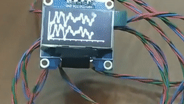

# OLED_SSD1306_Chart

Arduino library to **easily draw cartesian charts** in oled displays based on the SSD1306 drivers.



## What is it for?

This library is used to **easily draw cartesian charts** in oled displays based on the SSD1306 drivers. It inherits from [Adafruit_SSD1306](https://github.com/adafruit/Adafruit_SSD1306) class, reason why **it has all of this class functionalities**.

## How to install

Install the library using one of the following options

- [Arduino Library Manager](https://www.arduino.cc/en/Guide/Libraries)
- [Clone this repository into your libraries directory](https://help.github.com/articles/cloning-a-repository/)
- [Use it locally cloning this repository into your project's directory](https://help.github.com/articles/cloning-a-repository/)

## Compatibility

This library is compatible with any oled display which is compatible with [Adafruit_SSD1306](https://github.com/adafruit/Adafruit_SSD1306) library.

## How to use

### **Include the library**

```c++
#include <OLED_SSD1306_Chart.h>
```

### **Create an instance of the class**

Create an instance of `OLED_SSD1306_Chart` class for each oled display in which you would like to draw a cartesian chart. These objects constructors and [Adafruit_SSD1306](https://github.com/adafruit/Adafruit_SSD1306) objects constructors are the same. In this documentation will be explained only the I2C constructor.

```c++
// OLED_SSD1306_Chart instance
OLED_SSD1306_Chart display(SCREEN_WIDTH, SCREEN_HEIGHT, &Wire, OLED_RESET);
```

The class constructor takes the following arguments:

**w** : Screen width, usually 128.  
**h** : Screen height, usually 64 or 32.  
**\*twi** : Reference of `TwoWire` object.  
**rst_pin** : Reset pin, -1 if shared with microcontroller pin.  
**clkDuring** : Speed in Hz for I2C transmissions in the library calls. Defaults to 400 KHz.  
**clkAfter** : Speed in Hz for I2C transmissions following library calls. Defaults to 100 KHz.

```c++
// OLED_SSD1306_Chart class's constructor signature
OLED_SSD1306_Chart(uint8_t w, uint8_t h, TwoWire *twi, int8_t rst_pin=-1,
        uint32_t clkDuring=400000UL, uint32_t clkAfter=100000UL)
```

### **Configuring chart**

The library add new functionalities in order to configure the cartesian chart:

```c++
// Chart coordinates
display.setChartCoordinates(double x, double y);
```

The function `setChartCoordinates` is used to define the lower left chart coordinates.

```c++
// Chart width and height
display.setChartWidthAndHeight(double w, double h);
```

The function `setChartWidthAndHeight` defines the width and height of the chart.

```c++
// X axis increment
display.setXIncrement(double xinc);
```

The function `setXIncrement` defines the distance in pixels between Y points.

```c++
// X and Y axis divisions
display.setAxisDivisionsInc(double xinc, double yinc);
```

The function `setAxisDivisionsInc` defines the distance in pixels between which a division will be painted in the chart.

```c++
// Set Ymin and Ymax for each cartesian chart
display.setYLimits(double ylo, double yhi, uint8_t chart = 0);
```

The function `setYLimits` defines the minium and maxium Y values to each chart. When working in single plot mode just pass two first parameters.

```c++
// Sets the visibility of the Y axis labels
void setYLabelsVisible(bool yLabelsVisible);
```

The function `setYLabelsVisible` defines if the Y axis labels should be displayed. This will reduce the drawable area by the width of the labels defined in `setYLimitLabels`.

```c++
// Sets the textual labels for the y axis limits.
void setYLimitLabels(char* loLabel, char* hiLabel, uint8_t chart = 0;)
```

The function `setYLimitLabels` sets the textual labels that will be displayed at the upper and lower of each chart. The labels will only be displayed if their visibility is enabled via `setYLabelsVisible(true)`.

```c++
// Set point geometry for each chart
display.setPointGeometry(char pointGeometry, uint8_t chart = 0);
```

The function `setPointGeometry` defines a geometric shape to show in each point. Right now the only options are `POINT_GEOMETRY_NONE` and `POINT_GEOMETRY_CIRCLE`.

```c++
// Set plot mode
display.setPlotMode(char mode);
```

The function `setPlotMode` is used to configure if the chart will draw one or two cartesian charts

```c++
// Set plot mode defines
#define SINGLE_PLOT_MODE 0
#define DOUBLE_PLOT_MODE 1
```

These #define are used to pass as parameter to this function.

```c++
// Set mid line visibility
display.setMidLineVisible(bool lineVisible);
```

The function `setMidLineVisible` is used to show and hide a mid line between charts only in `DOUBLE_PLOT_MODE`

```c++
// Set plot mode
display.setLineThickness(char thickness, uint8_t chart = 0);
```

The function `setLineThickness` is used to set thickness of each chart

```c++
// Set plot mode defines
#define LIGHT_LINE 6
#define NORMAL_LINE 7
```

These #define are used to pass as parameter to this function.

### **Drawing chart**

```c++
// Draw chart
display.drawChart();
```

The function `drawChart` is used draw the cartesian chart. This function **must be called after calling all previous functions.**

### **Updating chart**

```c++
// Add Y points to chart
display.updateChart(double firstValue, double secondValue = 0);
```

The function `updateChart` is used to add new Y values to the chart. When working on single mode, only `firstValue` is needed. This function returns false when all X points have been used.

## Changelog

- **v1.0.0 (2020/01/05)**
  - library initial release
- **v1.1.0 (2020/03/21)**
  - added implementation for POINT_GEOMETRY_CIRCLE
- **v1.2.0 (2020/12/27)**
  - posibility to set Y axis labels in both plot modes. Thanks to [@felixkosmalla](https://github.com/felixkosmalla)
- **v1.3.0 (2020/12/30)**
  - fixed wrong behavior when value is not between min and max values
  - added implementation for `setMidLineVisible`
  - added implementation for `setLineThickness`
  - examples updated

## Examples

[SinglePlotMode](https://github.com/elC0mpa/OLED_SSD1306_Chart/blob/master/examples/SinglePlotMode/SinglePlotMode.ino)

[DoublePlotMode](https://github.com/elC0mpa/OLED_SSD1306_Chart/blob/master/examples/DoublePlotMode/DoublePlotMode.ino)

## Copyright

[MIT](../LICENSE.md) © [José Gabriel Companioni Benítez (elC0mpa)](https://github.com/elC0mpa)
